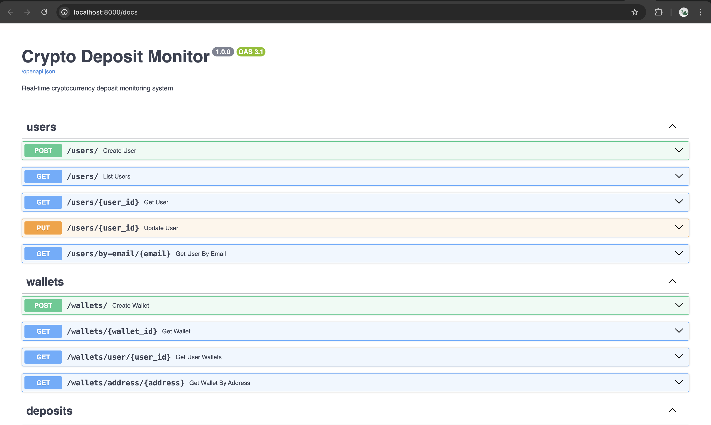
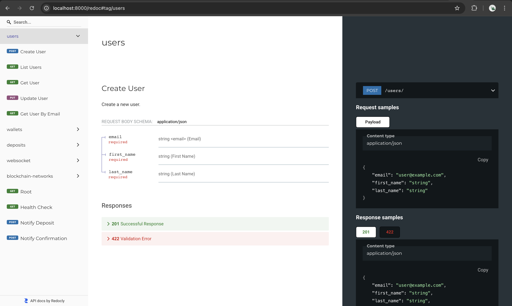

# Real-Time Crypto Deposit System

A backend system that monitors Ethereum blockchain transactions and provides real-time deposit status updates via WebSocket.

## Overview

This system detects incoming transactions to registered wallet addresses, records them in a database, and provides live status updates as confirmations accumulate. Built with Python, FastAPI, PostgreSQL, and Alchemy WebSocket API.

## Core Requirements Met

✅ **Deposit Monitoring Service** - Background service continuously monitors blockchain activity, detects transactions, records deposit data, and updates confirmations

✅ **Real-Time Status Updates** - Live updates show deposits detected (Pending), confirmation counts increasing, and completion status

✅ **WebSocket Integration** - Secure WebSocket endpoint handles multiple concurrent connections and broadcasts real-time events

## Quick Start

### Option 1: Docker Compose (Recommended)

```bash
# 1. Get an Alchemy API key from https://alchemy.com
# 2. Setup environment
cp .env.example .env
# Edit .env and add your ALCHEMY_API_KEY
# 3. Start everything
docker-compose up --build
# 4. Access at http://localhost:8000/docs (Swagger UI)
```

### Option 2: Local Development

```bash
# Setup
python -m venv venv
source venv/bin/activate
pip install -r requirements.txt

# Database
docker run --name postgres-crypto \
  -e POSTGRES_DB=crypto_deposits -e POSTGRES_USER=postgres \
  -e POSTGRES_PASSWORD=password -p 5432:5432 -d postgres:17

# Configure
cp .env.example .env
# Add your Alchemy API key

# Migrate
alembic upgrade head

# Run (in separate terminals)
uvicorn app.main:app --reload    # Terminal 1
python run_monitor.py           # Terminal 2
```

## Architecture

**API Server** - FastAPI application with REST endpoints and WebSocket handling
**Blockchain Monitor** - Background service subscribing to Ethereum via Alchemy WebSocket
**PostgreSQL** - Database for persistence
**Communication** - Monitor uses HTTP POST to notify API, which broadcasts to WebSocket clients

The processes run separately for independent scaling.

## Accessing the API

### Swagger UI (Interactive Documentation)

**URL:** http://localhost:8000/docs



Interactive API documentation with request/response schemas and the ability to test endpoints directly in the browser.

### ReDoc (Alternative Format)

**URL:** http://localhost:8000/redoc



### Health Check
http://localhost:8000/health

## Testing

### Using Swagger UI

1. Open http://localhost:8000/docs
2. Create a user with `/users/`
3. Add a wallet with `/wallets/`
4. Connect via WebSocket at `/ws/?wallet_address=0x...`
5. Send test ETH to monitored address
6. Watch real-time updates

### Using curl

```bash
# Create user
curl -X POST "http://localhost:8000/users/" \
  -H "Content-Type: application/json" \
  -d '{"email":"test@example.com","first_name":"John","last_name":"Doe"}'

# Add wallet
curl -X POST "http://localhost:8000/wallets/" \
  -H "Content-Type: application/json" \
  -d '{"user_id":"...","address":"0x1cA0881E0b17f28a9D1eB9AC2b4A2824d665715a","blockchain_network_id":"..."}'
```

### Optional Web UI

A web interface is available at http://localhost:8000 for testing (see `EXTRA_TASK_WITH_FRONTEND.md`). This is not part of the technical assessment - it's a simple way to test functionality without writing API calls.


## Database Schema

- **users** - User accounts (id, email, first_name, last_name, created_at)
- **wallets** - Wallet addresses per user (id, user_id, address, blockchain_network_id, label)
- **deposits** - Transaction records (id, wallet_id, tx_hash, amount, confirmations, status, block_number, created_at)
- **blockchain_networks** - Network configurations (id, name, chain_id, rpc_url, confirmations_required)

## WebSocket Events

```json
{
  "type": "deposit_update",
  "wallet_address": "0x...",
  "data": {
    "tx_hash": "0x...",
    "amount": "1.5",
    "confirmations": 3,
    "status": "processing"
  }
}
```

Event types: `deposit_update`, `confirmation_update`, `deposit_completed`, `deposit_orphaned`

## Design Decisions

**Separate Processes** - API and Monitor run independently for scalability and fault tolerance

**HTTP Communication** - Monitor notifies API via HTTP POST (simple, reliable, no extra dependencies)

**Address Normalization** - All addresses stored lowercase to handle Ethereum's case-insensitive addresses

**Async/Await Throughout** - Non-blocking I/O for handling many concurrent WebSocket connections

**UUID Primary Keys** - Globally unique IDs that work in distributed setups without coordination

**Confirmation Updates Every 15 Seconds** - Balances accuracy with database load (blocks arrive every ~12 seconds)

## Deliverables

✅ Complete Python implementation - All source code in `/app` directory  
✅ Blockchain monitoring logic - Real-time monitoring via WebSocket subscription  
✅ Real-time WebSocket system - Connection management and broadcasting  
✅ Database models and persistence - SQLAlchemy ORM with Alembic migrations  
✅ Database schema design - Proper normalization with foreign keys  
✅ Setup & run instructions - This file plus helper scripts  
✅ Design explanation - Architecture and decisions covered above  

## More Documentation

- **EXTRA_TASK_WITH_FRONTEND.md** - Optional web UI documentation

## Tech Stack

- **FastAPI** - REST API and WebSocket server
- **PostgreSQL** - Database via SQLAlchemy ORM
- **Alchemy** - Ethereum blockchain connectivity
- **Alembic** - Database migrations
